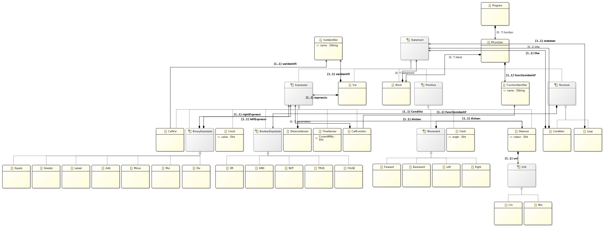

# Projet IDM_Langium - Amine Bakhtaoui

## Architecture
Le dépôt est composé de 2 parties principales :
- Le dossier [IDM](./IDM/) contient la partie modèle ECore et la génération en XText et Langium. Ce dossier correspond donc à la partie Eclipse.
- Le dossier [IDM Langium](./IDM%20Langium/) contient la syntaxe concrète Langium effectuée sur Visual Studio Code.

## ECore
Le modèle ECore ressemble se trouve dans le dossier [IDM/robot/](./IDM/robot/) et le diagramme associé ressemble à ceci :

## XText 
Le projet Xtext se trouve dans le dossier [IDM/fr.istic/](./IDM/fr.istic/). Il corrrespond à la génération automatique réalisé à partir du projet ECore. Aucune modification n'a été apportée directement sur ce projet, sauf ajouts nécessaires à la transformation Langium.
